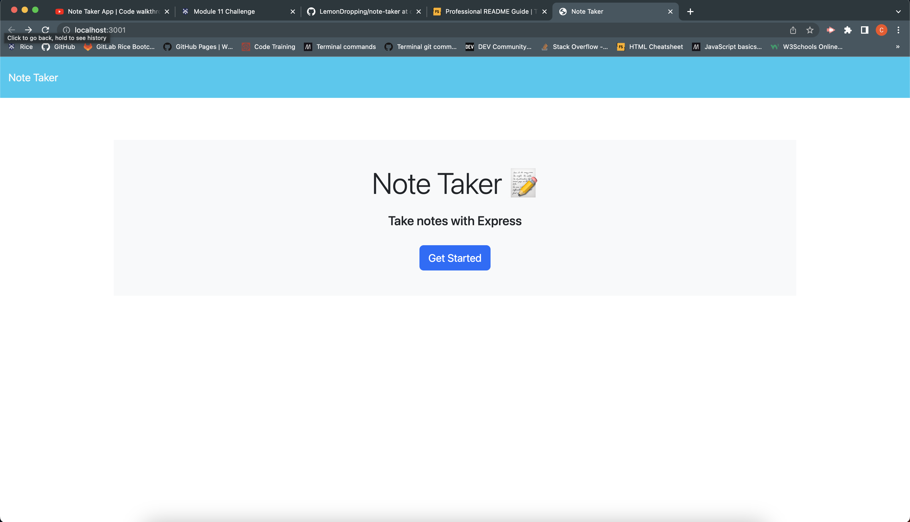
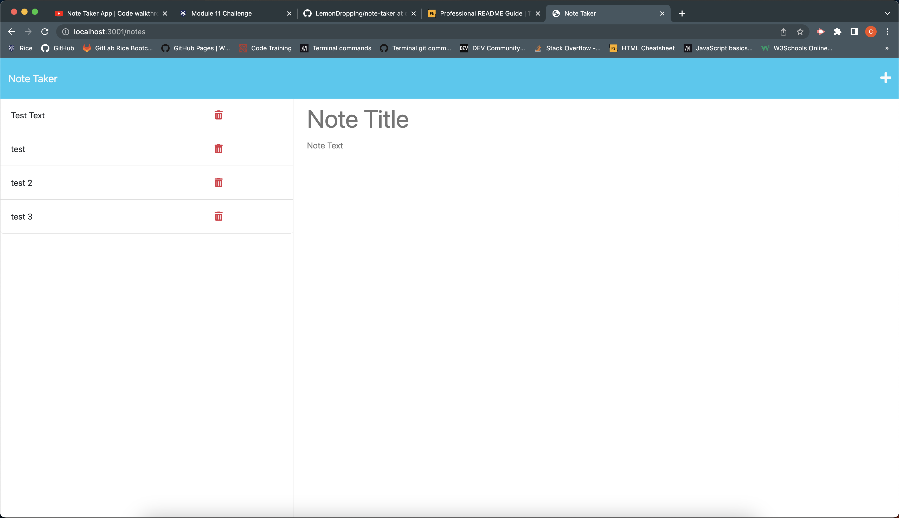
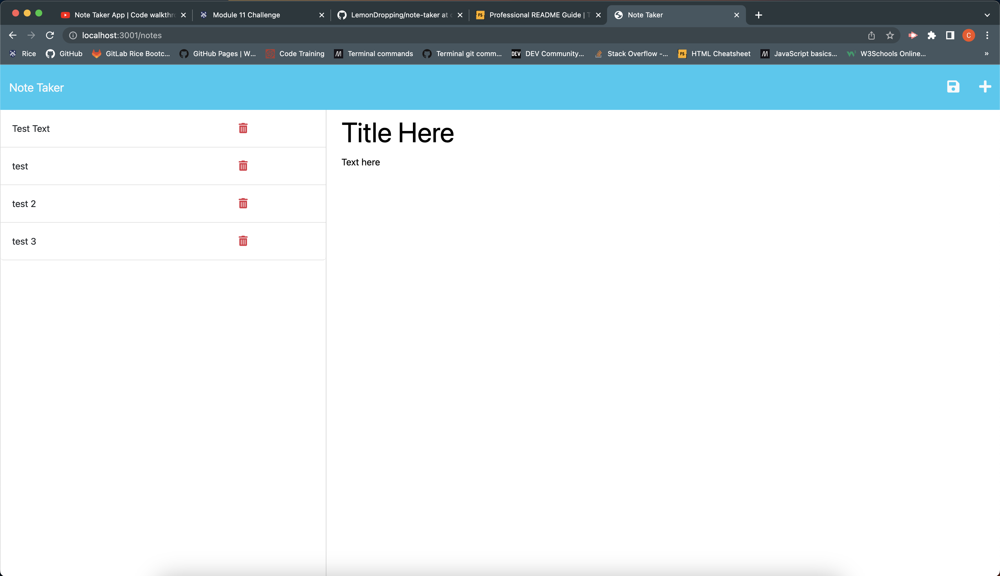
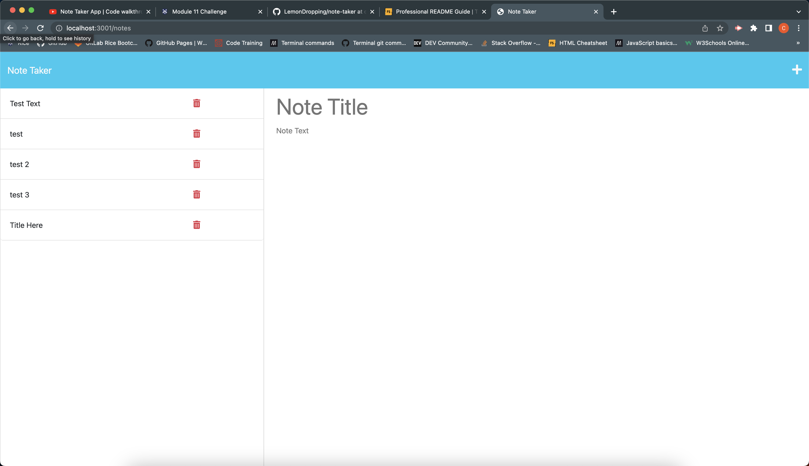

# Note Taker App

## Description

This note taking application allows users to keep track of their notes by using express.js to create the backend of this 
application. It saves the users notes and writes those saved notes to the db.json file. I learned and now have a good 
understanding of writing to a JSON file and using express.js to create the backend of this application.


## Instructions For Usage

1. Once in the website, click on the blue button titled, "Get Started."

2. Input a title and text for your note. the app needs both in order to function properly.

3. After you have types in your note, a save icon will appear in the top right of the screen. Click the save button.

4. You will see that the note has been added to the left of the page with a trashcan delete icon to the right of the note title. 

    ```md
    

    

    

    

    ```

## Credits

1. [chatGPT](https://chat.openai.com/chat)
 - Used for understanding writing to a JSON file. 

2. [Express](https://expressjs.com/en/starter/basic-routing.html)
 - Used as reference for my express.js routes, installation terminal command, static files and error handling.

3. [Youtube](https://www.youtube.com/watch?v=Oe421EPjeBE&ab_channel=freeCodeCamp.org)
 - Used for getting a detailed explanation of express.js and a refresher of Node.js

4. [Heroku](https://devcenter.heroku.com/articles/git)
 - Used as a guide for deploying to Heroku.

5. [Youtube](https://www.youtube.com/watch?v=DQk3zJlY-eE&t=84s&ab_channel=PedroTech)
 - Additional guidance for Heroku.